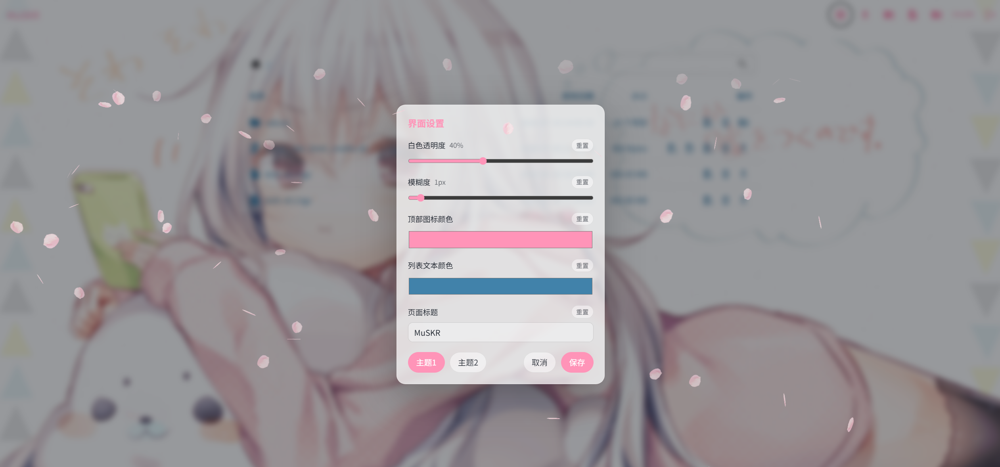
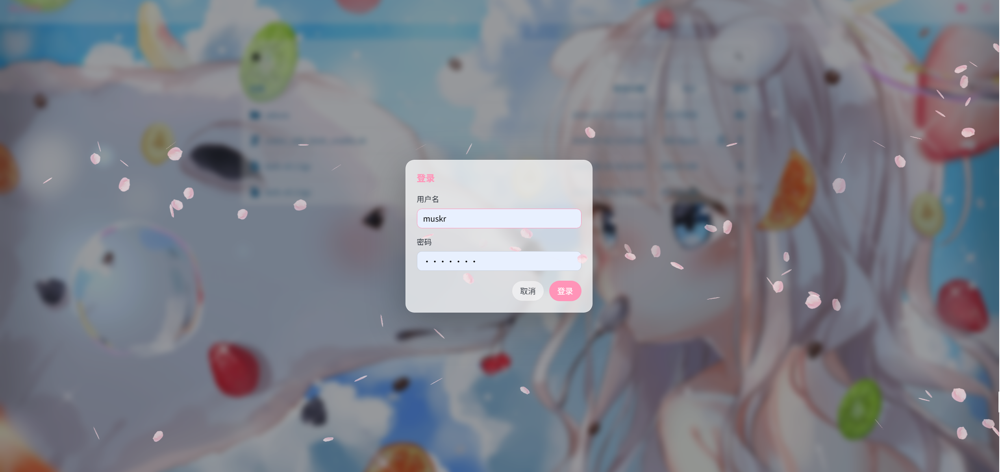

# dufs-m

这是基于 `dufs 0.46.0` 修改的个人文件共享版本。后端还是 Rust，前端是已经打包好的 Vue/Vuetify 静态资源，主要改动集中在 `src/`、`assets/custom-settings.js`、`assets/index.css`、`assets/index.html` 和部署脚本里。

## 界面展示






## 修改内容

- 登录改成页面中间的自定义弹窗，避免浏览器原生黑色 Basic Auth 弹窗；登录成功后写入 `dufs_auth` cookie。
- 浏览器关闭后自动退出登录：登录状态只在当前浏览器会话中保留，重新打开浏览器需要再次登录。
- 增加 `ui-settings.json` 主题配置，支持默认主题和每个登录用户自己的主题。
- 增加 `ui-settings-users` 权限列表，只有列表里的用户能看到设置按钮并修改主题。
- 匿名用户不能修改主题，但可以点击页面标题在主题一、主题二之间切换。
- 用户的主题会保存到服务端登入后切换每个用户的，并保存在浏览器上，匿名用户则是使用最后登入用户的主题
- 设置弹窗可以调整文件列表白色透明度、模糊度、顶部图标颜色、列表文本/图标颜色和页面标题。
- 页面标题保存时不能为空，避免标题被删空后不好点击切换主题。
- 新建文件、新建文件夹等弹窗样式改成和设置弹窗一致的半透明玻璃风格。
- 增加樱花鼠标素材和鼠标位置产生花瓣飘落效果，动画按真实时间步进，避免不同刷新率电脑下落速度明显不一致。
- 背景图默认使用随机图片接口，刷新就会重新拉取随机背景图，文件列表和顶部栏覆盖在背景上，透明度由主题控制。
- 增加 `scripts/dufsctl.sh`，用于本机编译、安装 systemd 服务、重启和查看状态。

## 编译

需要 Rust 工具链：

```bash
cargo build --release
```

编译结果在：

```bash
target/release/dufs
```

也可以用脚本：

```bash
scripts/dufsctl.sh build
```

## 本机部署

当前工程自带了 `dufs-share.yaml` 和 `dufs-share.service`，默认按源码目录部署：

```bash
scripts/dufsctl.sh all
```

等价于：

```bash
scripts/dufsctl.sh build deploy restart
```

查看状态：

```bash
scripts/dufsctl.sh status
```

默认服务名是 `dufs-share`。如果需要换服务名或配置文件：

```bash
SERVICE_NAME=dufs-test CONFIG_FILE=/path/to/dufs-share.yaml scripts/dufsctl.sh all
```

`deploy` 会把 systemd service 安装到 `/etc/systemd/system/dufs-share.service`，并自动创建缺失的 `ui-settings.json`。如果配置里没有写 `ui-settings-path`，会默认使用 `assets/ui-settings.json`。

## 115 设备部署方式

115 上当前推荐结构：

```text
/home/muskr/code/dufs            源码
/usr/local/bin/dufs              运行二进制
/etc/dufs/dufs-share.yaml        运行配置
/etc/dufs/ui-settings.json       主题配置
/opt/dufs-assets                 前端 assets
/root/shar                       共享目录
```

在 115 本机编译：

```bash
cd /home/muskr/code/dufs
cargo build --release
```

安装编译结果和 assets：

```bash
sudo install -m 0755 target/release/dufs /usr/local/bin/dufs
sudo mkdir -p /opt/dufs-assets /etc/dufs
sudo cp -a assets/. /opt/dufs-assets/.
sudo systemctl restart dufs-share
sudo systemctl status dufs-share --no-pager
```

115 的 service 示例：

```ini
[Unit]
Description=Dufs file share
After=network-online.target
Wants=network-online.target

[Service]
Type=simple
WorkingDirectory=/root/shar
ExecStart=/usr/local/bin/dufs --config /etc/dufs/dufs-share.yaml
Restart=on-failure
RestartSec=3

[Install]
WantedBy=multi-user.target
```

## 配置示例

`dufs-share.yaml` 示例：

```yaml
serve-path: /root/shar
bind: 0.0.0.0
port: 80
assets: /opt/dufs-assets
ui-settings-path: /etc/dufs/ui-settings.json
ui-settings-route: __dufs__/ui-settings
ui-settings-users:
  - muskr
auth:
  - 'muskr:CHANGE_ME@/:rw'
  - '@/'
allow-upload: true
allow-delete: true
allow-search: true
allow-archive: true
```

关键字段说明：

- `serve-path` 是网页里展示和共享的目录。
- `assets` 指向前端资源目录，必须包含 `index.html`。
- `ui-settings-path` 是主题配置保存位置；不写时会默认使用 `assets/ui-settings.json`。
- `ui-settings-route` 是前端读写主题配置的接口路径，默认是 `__dufs__/ui-settings`。
- `ui-settings-users` 是允许打开设置弹窗并保存主题的用户列表。
- `auth` 里 `muskr:CHANGE_ME@/:rw` 表示用户 `muskr` 对根目录有读写权限。
- `auth` 里 `@/` 表示匿名用户可以访问根目录，适合匿名下载。
- `allow-upload` 开启上传。
- `allow-delete` 开启删除。
- `allow-search` 开启搜索。
- `allow-archive` 开启目录打包下载。

权限规则常用写法：

```yaml
auth:
  - 'admin:password@/:rw'
  - 'user:password@/public,/download'
  - '@/'
```

`rw` 表示读写；没有 `:rw` 时通常只读。匿名用户用空用户名规则 `@/`。

## 主题配置

主题配置文件结构：

```json
{
  "default": {
    "activeTheme": "theme1",
    "pageTitle": "Dustin's file share",
    "themes": {
      "theme1": {
        "panelOpacity": 0.5,
        "panelBlur": 1,
        "accentColor": "#f7a8c4",
        "fileNameColor": "#121822"
      },
      "theme2": {
        "panelOpacity": 0.5,
        "panelBlur": 1,
        "accentColor": "#f7a8c4",
        "fileNameColor": "#121822"
      }
    }
  },
  "users": {}
}
```

行为说明：

- 未登录用户默认使用 `default` 主题。
- 用户登录后，会读取该用户自己的主题配置。
- 用户保存主题后，会写入 `users.<username>`。
- 登录用户的主题会同步到当前浏览器，之后匿名打开时也可以沿用上一次登录用户的主题效果。
- 只有 `ui-settings-users` 里的用户能看到设置按钮并保存配置。
- 普通登录用户和匿名用户只能点击页面标题切换主题一、主题二，不能修改设置。

## 背景图片

当前背景图在 `assets/index.html` 里设置：

```js
window.__CUSTOM_BACKGROUND_URL__ = `https://www.dmoe.cc/random.php?_dufs_bg=${Date.now()}_${Math.random().toString(36).slice(2)}`;
```

如果要换成固定网络图片：

```js
window.__CUSTOM_BACKGROUND_URL__ = "https://example.com/background.jpg";
```

如果要插入本地图片：

1. 在 assets 里创建目录：

```bash
mkdir -p assets/backgrounds
```

2. 把图片放进去，例如：

```text
assets/backgrounds/bg01.jpg
```

3. 修改 `assets/index.html`：

```js
window.__CUSTOM_BACKGROUND_URL__ = `${window.__DUFS_PREFIX__}backgrounds/bg01.jpg`;
```

4. 重新同步 assets 并重启服务：

```bash
sudo cp -a assets/. /opt/dufs-assets/.
sudo systemctl restart dufs-share
```

如果想随机使用多张本地图片，可以这样写：

```js
const backgrounds = [
    `${window.__DUFS_PREFIX__}backgrounds/bg01.jpg`,
    `${window.__DUFS_PREFIX__}backgrounds/bg02.jpg`,
    `${window.__DUFS_PREFIX__}backgrounds/bg03.jpg`,
];
window.__CUSTOM_BACKGROUND_URL__ = backgrounds[Math.floor(Math.random() * backgrounds.length)];
```

注意：目前还没有做“网页上传图片后自动作为背景”的功能。现在添加背景图需要手动放到 `assets/backgrounds/` 并修改 `assets/index.html`。

## 樱花鼠标素材

鼠标光标和花瓣素材在：

```text
assets/src/sakura/
```

主要文件：

- `normal.cur` 默认鼠标。
- `link.cur` 链接和按钮鼠标。
- `text.cur` 输入框鼠标。
- `petal.png` 飘落花瓣图片。

如果只想替换花瓣样式，替换 `assets/src/sakura/petal.png` 后重新同步 assets 并刷新浏览器即可。

## 常用维护命令

本机：

```bash
scripts/dufsctl.sh build restart status
```

115：

```bash
cd /home/muskr/code/dufs
cargo build --release
sudo install -m 0755 target/release/dufs /usr/local/bin/dufs
sudo cp -a assets/. /opt/dufs-assets/.
sudo systemctl restart dufs-share
systemctl status dufs-share --no-pager
```

打包源码和编译结果：

```bash
cd /home/muskr/code
tar --exclude=dufs/target --exclude=dufs/.git -czf /root/shar/dufs-source.tgz dufs
tar -czf /root/shar/dufs-bin.tgz -C /home/muskr/code/dufs/target/release dufs
```
